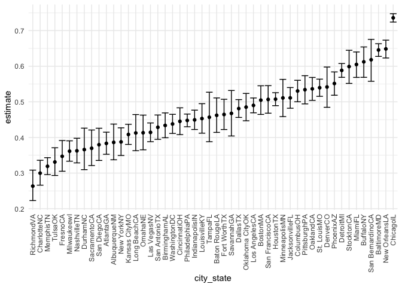
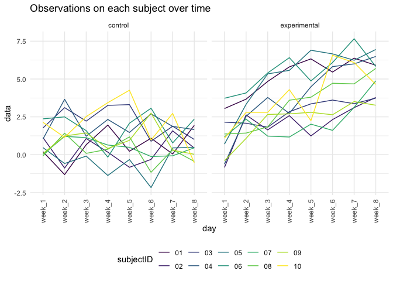

p8105\_hw5\_wl2829
================
Wentong
11/19/2021

## Problem 1

``` r
homicide_df = 
  read_csv("./data/homicide-data.csv", na = c("", "Unknown")) %>% 
  mutate(
    city_state = str_c(city, state),
    resolution = case_when(
      disposition == "Closed without arrest" ~ "unsolved",
      disposition == "Open/No arrest"        ~ "unsolved",
      disposition == "Closed by arrest"      ~ "solved"
    )
  ) %>% 
  relocate(city_state) %>% 
  filter(city_state != "TulsaAL")
```

    ## Rows: 52179 Columns: 12

    ## ── Column specification ────────────────────────────────────────────────────────
    ## Delimiter: ","
    ## chr (8): uid, victim_last, victim_first, victim_race, victim_sex, city, stat...
    ## dbl (4): reported_date, victim_age, lat, lon

    ## 
    ## ℹ Use `spec()` to retrieve the full column specification for this data.
    ## ℹ Specify the column types or set `show_col_types = FALSE` to quiet this message.

Focus on Baltimore, MD

``` r
baltimore_df = 
  homicide_df %>% 
  filter(city_state == "BaltimoreMD")

baltimore_summary = 
  baltimore_df %>% 
  summarize(
    unsolved = sum(resolution == "unsolved"),
    n = n()
  )

baltimore_test = 
  prop.test(
    x = baltimore_summary %>% pull(unsolved),
    n = baltimore_summary %>% pull(n)
)

baltimore_test %>% 
  broom::tidy()
```

    ## # A tibble: 1 × 8
    ##   estimate statistic  p.value parameter conf.low conf.high method    alternative
    ##      <dbl>     <dbl>    <dbl>     <int>    <dbl>     <dbl> <chr>     <chr>      
    ## 1    0.646      239. 6.46e-54         1    0.628     0.663 1-sample… two.sided

Iterate across cities!

``` r
prop_test_function = function(city_df){
  city_summary = 
    city_df %>% 
    summarize(
      unsolved = sum(resolution == "unsolved"),
      n = n()
    )

  city_test = 
    prop.test(
      x = city_summary %>% pull(unsolved),
      n = city_summary %>% pull(n)
    )
  return(city_test)
}

homicide_df %>% 
  filter(city_state == "AlbuquerqueNM") %>% 
  prop_test_function()
```

    ## 
    ##  1-sample proportions test with continuity correction
    ## 
    ## data:  city_summary %>% pull(unsolved) out of city_summary %>% pull(n), null probability 0.5
    ## X-squared = 19.114, df = 1, p-value = 1.232e-05
    ## alternative hypothesis: true p is not equal to 0.5
    ## 95 percent confidence interval:
    ##  0.3372604 0.4375766
    ## sample estimates:
    ##         p 
    ## 0.3862434

Iterate across all cities.

``` r
results_df = 
  homicide_df %>% 
  nest(data = uid:resolution) %>% 
  mutate(
    test_results = map(data, prop_test_function),
    tidy_results = map(test_results, broom::tidy)
  ) %>% 
  select(city_state, tidy_results) %>% 
  unnest(tidy_results) %>% 
  select(city_state, estimate, starts_with("conf"))
```

Make a plot showing estimates and confidence intervals.

``` r
results_df %>% 
  mutate(
    city_state = fct_reorder(city_state, estimate)
  ) %>% 
  ggplot(aes(x = city_state, y = estimate)) +
  geom_point() +
  geom_errorbar(aes(ymin = conf.low, ymax = conf.high)) +
  theme(axis.text.x = element_text(angle = 90, vjust = 0.5, hjust = 1))
```

<!-- -->

``` r
homicide_df %>% 
  group_by(city_state) %>% 
  summarize(
    unsolved = sum(resolution == "unsolved"),
    n = n()
  ) %>% 
  mutate(
    test_results = map2(unsolved, n, prop.test),
    tidy_results = map(test_results, broom::tidy)
  ) %>% 
  select(city_state, tidy_results) %>% 
  unnest(tidy_results) %>% 
  select(city_state, estimate, starts_with("conf"))
```

    ## # A tibble: 50 × 4
    ##    city_state    estimate conf.low conf.high
    ##    <chr>            <dbl>    <dbl>     <dbl>
    ##  1 AlbuquerqueNM    0.386    0.337     0.438
    ##  2 AtlantaGA        0.383    0.353     0.415
    ##  3 BaltimoreMD      0.646    0.628     0.663
    ##  4 Baton RougeLA    0.462    0.414     0.511
    ##  5 BirminghamAL     0.434    0.399     0.469
    ##  6 BostonMA         0.505    0.465     0.545
    ##  7 BuffaloNY        0.612    0.569     0.654
    ##  8 CharlotteNC      0.300    0.266     0.336
    ##  9 ChicagoIL        0.736    0.724     0.747
    ## 10 CincinnatiOH     0.445    0.408     0.483
    ## # … with 40 more rows

## Problem 2

Create a dataframe including every files

``` r
file_name_df = 
  tibble(
    files_name = list.files("./data/problem2_data")
  )
```

Iterate over file names and read in data for each subject

``` r
file_content = file_name_df %>%
  mutate(file_contents = map(files_name,      
           ~ read_csv(file.path("./data/problem2_data", .))) 
  )
```

Tidy the result

``` r
file_df = 
  file_content %>% 
  separate(files_name, into = c("arm", "subjectID", sep = "file_type")) %>% 
  select(arm, subjectID, file_contents) %>% 
  unnest(file_contents) %>% 
  pivot_longer(
    week_1:week_8,
    names_to = "day",
    values_to = "data"
  ) %>%
  mutate(arm = recode(arm, 'con'='control', 'exp'='experimental'))

file_df 
```

    ## # A tibble: 160 × 4
    ##    arm     subjectID day     data
    ##    <chr>   <chr>     <chr>  <dbl>
    ##  1 control 01        week_1  0.2 
    ##  2 control 01        week_2 -1.31
    ##  3 control 01        week_3  0.66
    ##  4 control 01        week_4  1.96
    ##  5 control 01        week_5  0.23
    ##  6 control 01        week_6  1.09
    ##  7 control 01        week_7  0.05
    ##  8 control 01        week_8  1.94
    ##  9 control 02        week_1  1.13
    ## 10 control 02        week_2 -0.88
    ## # … with 150 more rows

Make a spaghetti plot (experimental vs control)

``` r
file_df %>% 
  ggplot(aes(x = day, y = data, group = subjectID, color = subjectID)) +
  geom_line() +
  facet_grid(. ~ arm) +
  theme(axis.text.x = element_text(angle = 90, vjust = 0.5, hjust = 1)) +
  ggtitle("Observations on each subject over time")
```

<!-- -->
From the plot, we can compare the data of two groups. The experimental
data is higher than the other set of data, and there is a gradual upward
trend from week\_1 to week\_8. Although the data trend of control group
is relatively stable, there are still some fluctuations in each group in
the middle of the week.

## Problem 3

Load the datasets and fill in the missing values.

``` r
library(tidyverse)

set.seed(10)

iris_with_missing = iris %>% 
  map_df(~replace(.x, sample(1:150, 20), NA)) %>%
  mutate(Species = as.character(Species))
```

Use vector function to fill in missing values.

``` r
fill_in_missing = function(vector){
  
  if(is.numeric(vector)){
    vector = ifelse(is.na(vector), mean(vector, na.rm = TRUE), vector)

  }
  else{
    vector = ifelse(is.na(vector), "virginica", vector)
  }
}

output = map(iris_with_missing, fill_in_missing)

results_df = bind_rows(output)

results_df
```

    ## # A tibble: 150 × 5
    ##    Sepal.Length Sepal.Width Petal.Length Petal.Width Species
    ##           <dbl>       <dbl>        <dbl>       <dbl> <chr>  
    ##  1         5.1          3.5         1.4         0.2  setosa 
    ##  2         4.9          3           1.4         0.2  setosa 
    ##  3         4.7          3.2         1.3         0.2  setosa 
    ##  4         4.6          3.1         1.5         1.19 setosa 
    ##  5         5            3.6         1.4         0.2  setosa 
    ##  6         5.4          3.9         1.7         0.4  setosa 
    ##  7         5.82         3.4         1.4         0.3  setosa 
    ##  8         5            3.4         1.5         0.2  setosa 
    ##  9         4.4          2.9         1.4         0.2  setosa 
    ## 10         4.9          3.1         3.77        0.1  setosa 
    ## # … with 140 more rows
